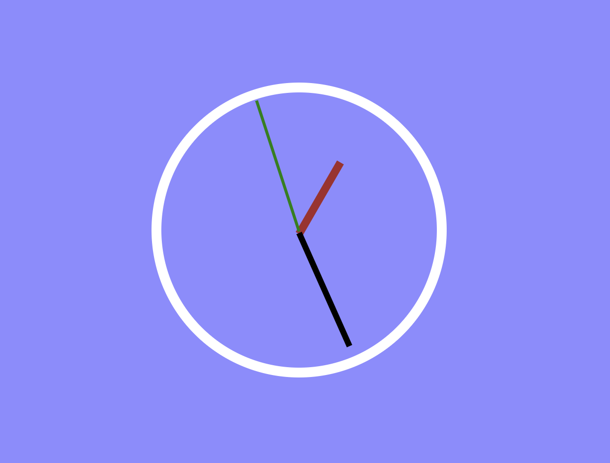

# Day2. JS and CSS Clock

간단한 아날로그 시계 구현

### 학습내용

1. 기초 CSS (position, transform, transition)
2. cubic-bezier
3. setInterval, clearInterval
4. 기능 단위의 함수 제작의 필요성

### 추가 필요학습 사항

1. 심화 CSS(애니메이션)
2. 로직 고도화
    - 시간&각도 처리 간 출력에 대한 문제(한바퀴 회전하면 )
    - 시, 분 값을 초당 비교하여 불필요한 분침, 시침 element들의 style 요소에 접근 방지
3. 전역변수가 아닌 클로저를 통한 프라이빗하게 상태관리 제작 방법 고안
4. Typescript 리팩토링

출처: [https://JavaScript30.com](https://JavaScript30.com)
