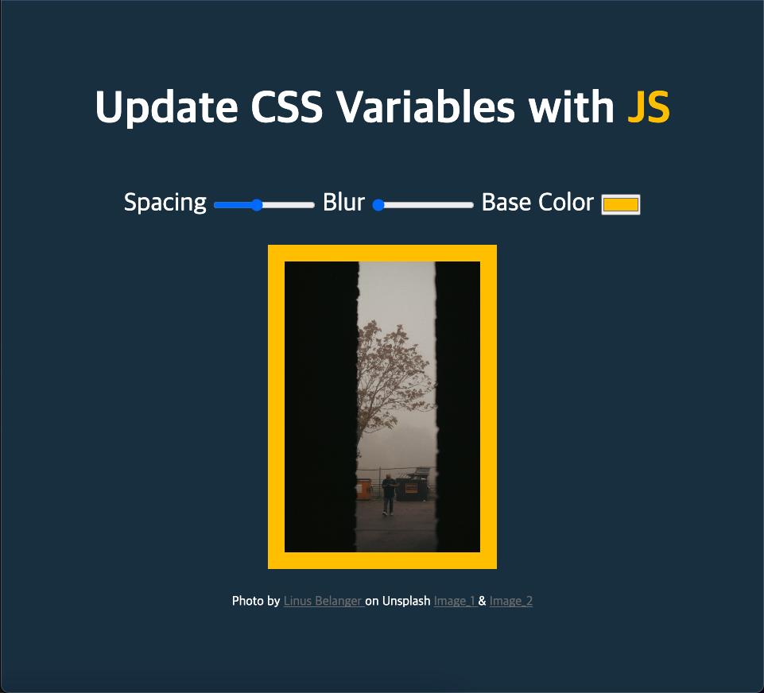

# Day3. Playing with CSS Variables and JS

JS를 활용한 CSS 이미지 속성값 변경 기능 구현

### 학습내용

1. 기초 HTML, CSS (source 미디어 쿼리, dark-mode, input, :root 변수 등)
2. User-Agent(브라우저) 불일치에 따른 점검의 필요성
3. this
4. HTMLcollection(prototype, symbol)

### 추가 필요학습 사항

1. 함수 제작 시 충분한 고려의 필요성
2. HTML DOM load 단계
3. User-Agent 심화학습
4. Dark Mode에 따른 HTML, CSS, JS 대처방안 고도화(일관성, 지속성 등)

출처: [https://JavaScript30.com](https://JavaScript30.com)
